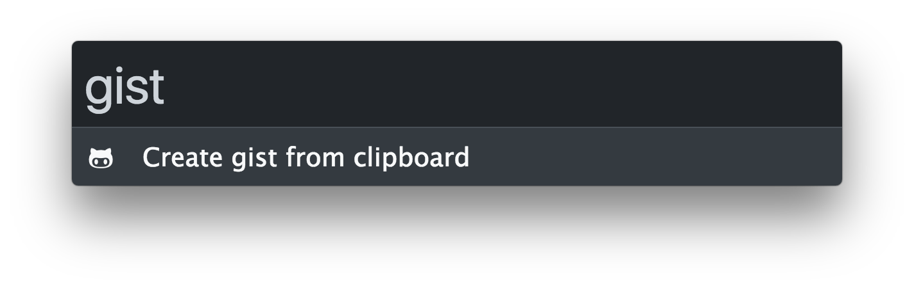

## Zazu Gist

Create gists from Zazu!

### Usage

You can type in just `gist`:

You can also specify a file name `gist hello.txt`.

### Installation

If you are okay with making your gists anonymous, and possibly getting
rate-limited you can install this plugin normally:

~~~ json
"plugins": [
  "afaur/zazu-gist"
]
~~~

If you want the gist under your account, specify an API token like this:

~~~ json
"plugins": [
  {
    "name": "afaur/zazu-gist",
    "variables": {
      "token": "6fac18b7a5522c61b55bd407d6b47f5309f22fc1",
    }
  }
]
~~~
